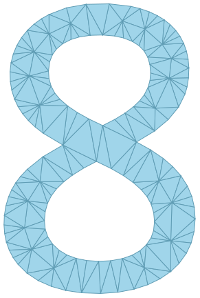

# Simplicial Homology

[](https://github.com/zplus11/SimplicialHomology/releases)
[](https://github.com/zplus11/SimplicialHomology/blob/main/LICENSE)
[](https://doi.org/10.5281/zenodo.21309175)

 is a Wolfram Language paclet (package) for constructing, manipulating, and analysing abstract simplicial complexes. It provides tools for computing simplicial homology, performing common topological constructions, and studying combinatorial invariants of finite simplicial complexes. So far, Mathematica in-built or third party support for simplicial homology or discrete topology in general. Primarily, that motivated the development of this package. I have largely taken both inspiration and reference from the implementation of simplicial complexes in sagemath (Python).

Features include construction of simplicial complexes from facets or cells, computation of reduced and unreduced homology groups, Euler characteristic and f-vectors, joins, cones, suspensions, and access to a collection of standard and enumerated simplicial complexes for testing and experimentation. The paclet is designed for research, education, and computational topology workflows in the Wolfram Language.

Wolfram paclet repository: https://resources.wolframcloud.com/PacletRepository/resources/Taggar/SimplicialHomology/

# Installation

Easily install the package from Wolfram paclet repository using the following command:

```mathematica
PacletInstall["Taggar/SimplicialHomology"]
```

# Usage

Import the package by running

```mathematica
In[1]:= <<Taggar`SimplicialHomology`
```

Create a simplicial complex using facets as follows:

```mathematica
In[2]:= S1 = SimplicialComplex[{{1, 2}, {2, 3}, {3, 1}}];
```

or using one of the named objects:

```mathematica
In[3]:= torus = SimplicialComplex["Torus"];
```

Calculate the homology groups of torus:

```mathematica
In[4]:= HomologyGroup[torus]
Out[4]= <|0 -> Integers, 1 -> Superscript[Integers, 2], 2 -> Integers|>
```

or Betti numbers of <i>S</i><sup>1</sup>:

```mathematica
In[5]:= BettiNumber[S1]
Out[5]= <|0 -> 1, 1 -> 1|>
```

Calculate cone, suspension, or join of spaces:

```mathematica
In[6]:= SimplicialCone[torus]
In[7]:= SimplicialSuspension[S1]
In[8]:= SimplicialJoin[S1, torus]
```

Check that two simplicial complexes are isomorphic to each other:

```mathematica
In[9]:= SimplicialIsomorphicQ[
            SimplicialComplex[{{1, 2, 3}}],
            SimplicialComplex[{{a, b, c}, {b, c}}]]
Out[9]= True
```

Find the automorphism group of a simplicial complex:

```mathematica
In[10]:= SimplicialAutomorphismGroup[SimplicialComplex["RealProjectivePlane"]]
Out[10]= PermutationGroup[{Cycles[{{3, 5},{4, 6}}], Cycles[{{2, 3}, {5, 6}}], Cycles[{{1, 2}, {3, 5}}]}]
```

Verify that it is isomorphic to the alternating group of degree 5:

```mathematica
In[11]:= ResourceFunction["FindGroupIsomorphism"][%, AlternatingGroup[5]]
Out[11]= True
```

Construct stars or links of simplices:

```mathematica
In[12]:= sc = SimplicialComplex[{{1, 2, 3}, {2, 3, 4}}];
In[13]:= SimplicialStar[sc, {1}]
In[14]:= SimplicialLink[sc,{2, 3}]
```

For a full reference, visit the homepage at Wolfram paclet repository [here](https://resources.wolframcloud.com/PacletRepository/resources/Taggar/SimplicialHomology/).

# Future scope

- simplicial maps
- wedge products
- formalisation of chain complexes

# Version log

**Version 1.1.1,** *on 8 August, 2026* &mdash; support for simplicial products and a bug fix

**Version 1.1.0,** *on 1 August, 2026* &mdash; support for relative homology and stars & links
 
**Version 1.0.0,** *on 10 July, 2026* &mdash; public release

**Version 0.0.1,** *on 08 July, 2026* &mdash; initial upload with homology, Betti numbers and joins

# Contributions

are more than welcome. Open an issue to discuss!

# References

[1] Munkres, J. R. Elements of Algebraic Topology, Addison Wesley Publishing Company, 1984.

[2] Hatcher A., Algebraic Topology, Cambridge University Press, Cambridge, 2002.
W. Kühnel and T. F. Banchoff, The 9-vertex complex projective plane, Math. Intelligencer 5 (1983), no. 3, 11-22. doi:10.1007/BF03026567

[3] M. Hachimori. http://infoshako.sk.tsukuba.ac.jp/~hachi/math/library/dunce_hat_eng.html.

[4] Anders Björner and Frank H. Lutz, Simplicial manifolds, bistellar flips and a 16-vertex triangulation of the Poincaré homology 3-sphere, Experiment. Math. 9 (2000), no. 2, 275-289.

[5] U. Brehm and W. Kuhnel, 15-vertex triangulations of an 8-manifold, Math. Annalen 294 (1992), no. 1, 167-193.

[6] M. E. Rudin. An unshellable triangulation of a tetrahedron. Bull. Amer. Math. Soc. 64 (1958), 90-91.

[7] Frank H. Lutz, Császár's Torus, Electronic Geometry Model No. 2001.02.069 (2002). http://www.eg-models.de/models/Classical_Models/2001.02.069/_direct_link.html.

[8] G. M. Ziegler. Shelling polyhedral 3-balls and 4-polytopes. Discrete Comput. Geom. 19 (1998), 159-174. doi:10.1007/PL00009339

[9] https://doc.sagemath.org/html/en/reference/topology/sage/topology/simplicial_complex.html

[10] https://doc.sagemath.org/html/en/reference/topology/sage/topology/simplicial_complex_examples.html

[11] https://doc.sagemath.org/html/en/reference/references/index.html

[12] https://resources.wolframcloud.com/FunctionRepository/resources/FindGroupIsomorphism/


